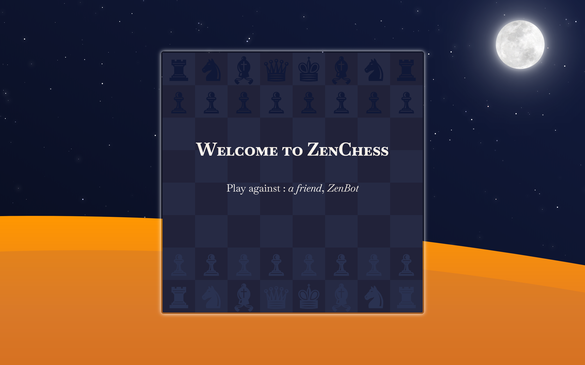
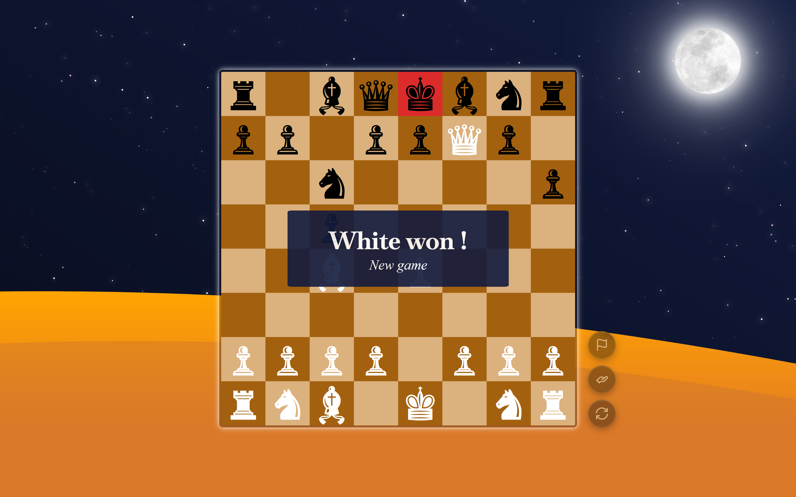

# ZenChess
A chess game with a zen user interface.





Many thanks to interaminense for letting me use his beautiful [Starry Sky](https://github.com/interaminense/starry-sky).

#### API key (sage / Mistral)

The sage reflection feature calls the [Mistral AI](https://mistral.ai/) chat API. Copy `.env.example` to `.env`, set `MISTRAL_API_KEY` to your key from the [Mistral console](https://console.mistral.ai/api-keys/), and optionally `MISTRAL_MODEL` (default: `mistral-small-latest`).

```bash
cp .env.example .env
# Edit .env: MISTRAL_API_KEY=your_key
```

#### To launch the site

```bash
pip install -r requirements.txt
python app.py
```

Open [http://localhost:5000](http://localhost:5000)
